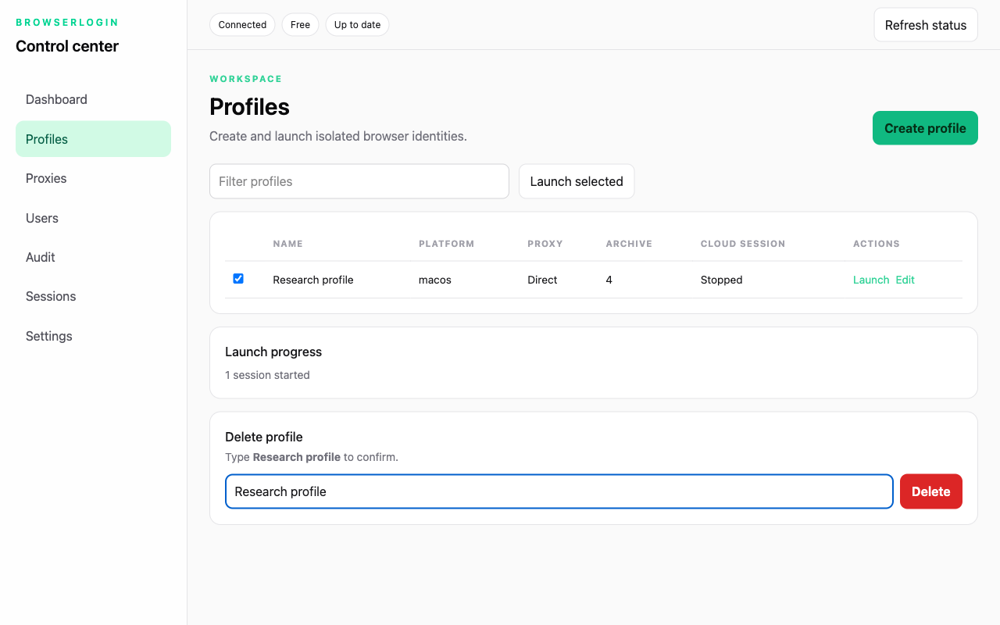
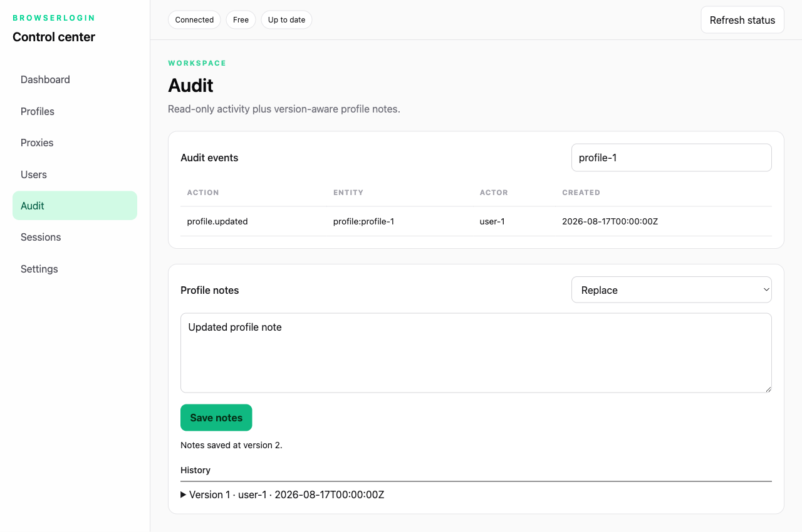
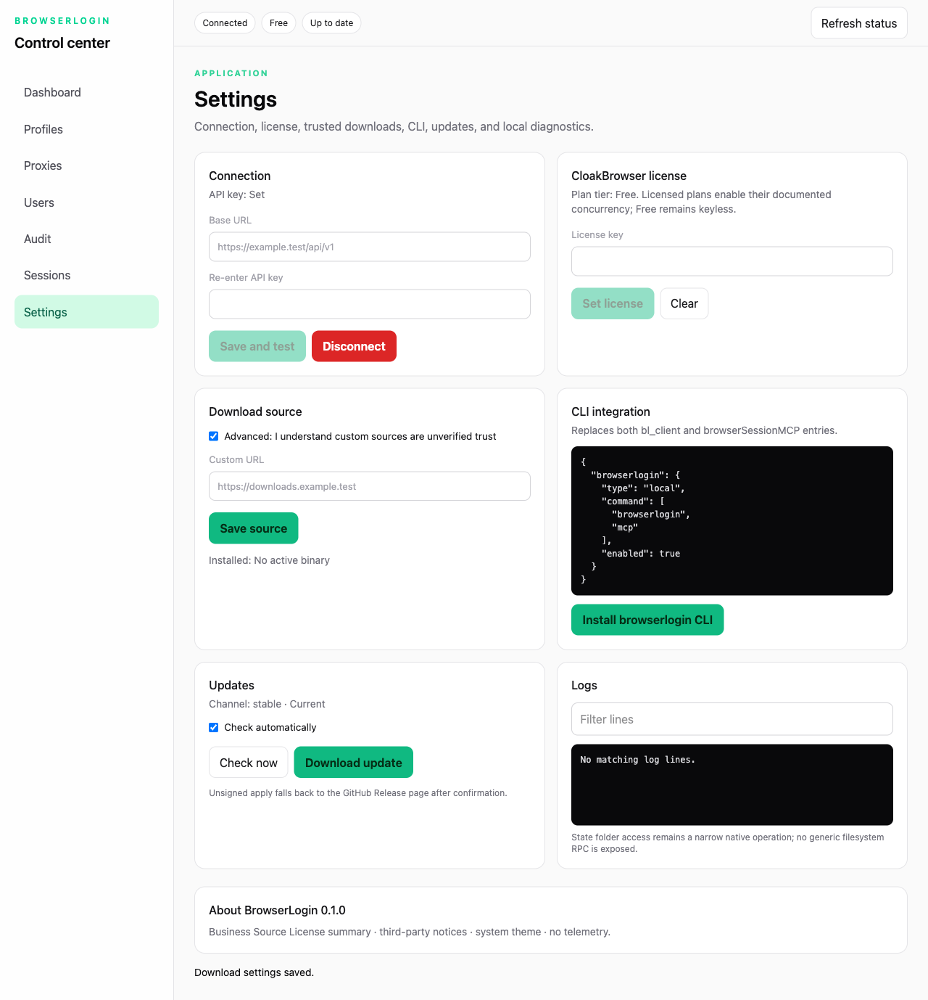

# BrowserLogin Client

[](https://github.com/iamkhalidbashir/browserlogin-client/actions/workflows/ci.yml)

BrowserLogin Client is a source-available desktop, CLI, and unified MCP client for BrowserLogin profiles and CloakBrowser sessions. It shares one private state root across interfaces, stores credentials through the operating-system keychain adapter, and preserves profile data through verified archive workflows.

## Features

- Electrobun desktop application for setup, profile launch, session monitoring, administration, notes/audit history, downloads, updates, logs, and settings.
- Compiled `browserlogin` CLI for setup, profiles, lifecycle operations, diagnostics, binary downloads, and MCP startup.
- One local MCP server combining BrowserLogin lifecycle tools, profile-scoped browser tools, and 17 remote BrowserSessionMCP tools when available.
- Humanized input using a verified ONNX policy with bounded classical fallback.
- Verified official CloakBrowser downloads, isolated custom-source installs, and explicit trust labels.
- Recovery and idempotency guards for interrupted starts, uploads, stops, and force stops.

> BrowserLogin Client does not bundle or publish a CloakBrowser/Chromium binary. It downloads a verified browser at runtime when required.

## Screenshots

| Profiles and launch                                         | Administration                                                 | Settings                                                    |
| ----------------------------------------------------------- | -------------------------------------------------------------- | ----------------------------------------------------------- |
|  |  |  |

The screenshots use local mock data and contain no production credentials or servers.

## Install

Download the asset for your platform from [GitHub Releases](https://github.com/iamkhalidbashir/browserlogin-client/releases). Release artifacts are unsigned until a signing/notarization process is introduced.

Release filenames use the version without the tag's leading `v`: tag `v0.1.1` produces filenames containing `0.1.1`.

### macOS ARM64

1. Download `BrowserLogin-<version>-macos-arm64.dmg`, open it, and move BrowserLogin to Applications.
2. On first launch, use Finder **right-click → Open** to approve the unsigned application. As an explicit alternative, remove quarantine metadata yourself with `xattr -cr /Applications/BrowserLogin.app` after verifying the checksum.
3. For terminal/MCP use, download `browserlogin-<version>-macos-arm64` plus `browserlogin-browser-tools-macos-arm64`. Make both executable, place the CLI on `PATH` as `browserlogin`, and keep the helper beside it under its release filename.

### Windows x64

1. Download and extract `BrowserLogin-<version>-windows-x64-Setup.zip`, then run the installer.
2. If SmartScreen appears, select **More info → Run anyway** after verifying the checksum.
3. Download `browserlogin-<version>-windows-x64.exe` plus `browserlogin-browser-tools-windows-x64.exe`. Place both in the same directory, put that directory on `PATH`, and rename only the CLI to `browserlogin.exe`.

### Linux x64

1. On Ubuntu 24.04, install the runtime dependencies:

   ```sh
   sudo apt-get update
   sudo apt-get install -y libwebkit2gtk-4.1-0 libgtk-3-0 libayatana-appindicator3-1
   ```

2. Download and extract `BrowserLogin-<version>-linux-x64-Setup.tar.gz`, then run the included launcher.
3. Download `browserlogin-<version>-linux-x64` plus `browserlogin-browser-tools-linux-x64`, make both executable, place the CLI on `PATH` as `browserlogin`, and keep the helper beside it under its release filename.

Verify every downloaded file against the release `SHA256SUMS` before running it.

## Quickstart

Start the desktop application and complete the connection form, or configure the same connection from a terminal:

```sh
browserlogin setup
browserlogin profiles --json
browserlogin start PROFILE_ID
browserlogin status --json
browserlogin stop PROFILE_ID
```

`setup` stores the base URL plus a keychain marker in the private state root; the API key goes to the platform keychain backend. For managed environments, set `BROWSERLOGIN_API_KEY` (optionally `BROWSERLOGIN_BASE_URL` and `CLOAKBROWSER_LICENSE_KEY`) and run:

```sh
browserlogin setup --api-key-env
```

Force close discards uncommitted local browser changes and requires explicit confirmation:

```sh
browserlogin stop PROFILE_ID --force --yes
```

## CLI reference

| Command                                        | Purpose                                                                              |
| ---------------------------------------------- | ------------------------------------------------------------------------------------ |
| `browserlogin profiles [--json]`               | List profile ID, name, platform, archive generation, and coarse cloud-session state. |
| `browserlogin start PROFILE_ID`                | Start or recover a profile session and verified local runner.                        |
| `browserlogin stop PROFILE_ID`                 | Perform the normal archive-preserving stop workflow.                                 |
| `browserlogin stop PROFILE_ID --force [--yes]` | Force close after the exact `FORCE CLOSE PROFILE_ID` confirmation contract.          |
| `browserlogin mcp`                             | Run the unified stdio MCP server.                                                    |
| `browserlogin setup [--api-key-env]`           | Save connection settings/keychain credentials or document environment mode.          |
| `browserlogin status [--json]`                 | Print live-session, binary, and updater state.                                       |
| `browserlogin binary download [--pro]`         | Download and verify the configured CloakBrowser build.                               |
| `browserlogin doctor [--json]`                 | Check connection, state root, relay port 4290, and remote MCP configuration.         |
| `browserlogin install-cli`                     | Copy the current executable to the platform user CLI location.                       |

Global options include `--state-dir ABSOLUTE_PATH`, `--json`, and `--verbose` where applicable. Exit `0` means success, `2` means usage/setup is required, and `3` means an operational failure.

## OpenCode MCP configuration

Use one local MCP entry:

```jsonc
{
  "mcp": {
    "browserlogin": {
      "type": "local",
      "command": ["browserlogin", "mcp"],
      "enabled": true,
    },
  },
}
```

The complete catalog contains 26 lifecycle/browser tools in degraded local-only mode and 43 tools when remote discovery succeeds. By default, the unsafe code-execution tool is hidden, so visible counts are 25 and 42. Setting `BROWSERLOGIN_ALLOW_UNSAFE_BROWSER_CODE=1` restores the full 26/43 catalog. Remote tools retain their names and schemas. See [the migration guide](docs/opencode-migration.md).

## State and environment

Default state roots:

- macOS: `~/Library/Application Support/BrowserLogin`
- Windows: `%LOCALAPPDATA%\BrowserLogin`
- Linux: `$XDG_STATE_HOME/browserlogin`, otherwise `~/.local/state/browserlogin`

`BROWSERLOGIN_STATE_DIR` must be absolute.

| Variable                                   | Meaning                                                               |
| ------------------------------------------ | --------------------------------------------------------------------- |
| `BROWSERLOGIN_API_KEY`                     | Nonempty BrowserLogin key override; never commit it.                  |
| `BROWSERLOGIN_BASE_URL`                    | BrowserLogin API base URL override.                                   |
| `CLOAKBROWSER_LICENSE_KEY`                 | Optional CloakBrowser license-key override.                           |
| `CLOAKBROWSER_LICENSE_API`                 | Optional license API origin; at most 24 ASCII bytes including scheme. |
| `BROWSERLOGIN_MCP_REMOTE_URL`              | Remote BrowserSessionMCP endpoint override.                           |
| `BROWSERLOGIN_MCP_REMOTE_TOKEN`            | Remote MCP bearer override.                                           |
| `BROWSERLOGIN_ALLOW_UNSAFE_BROWSER_CODE=1` | Expose RCE-equivalent `browser_run_code_unsafe`.                      |

See [the architecture guide](docs/architecture.md) for the complete security and process model.

## Updating

The app checks the rolling `stable` release metadata. Unsigned automatic apply was not proven reliable on every platform, so the UI provides **Update available – download** and links to the tagged GitHub Release. Prerelease tags publish tagged artifacts but do not mutate `stable`.

## Development

Requirements: Bun `1.2.23`, Hutch `0.10.0`, and the native dependencies shown in CI.

```sh
bun install --frozen-lockfile
bun scripts/electrobun.ts sync
bun run typecheck
bun run lint
bun run test
bun run test:integration
bun run test:contract
bun run test:e2e
bun run notices:check
```

Start a development app with a disposable state root and wait for readiness:

```sh
export BROWSERLOGIN_STATE_DIR="$(mktemp -d -t browserlogin-dev.XXXXXX)"
bun run build:web
bun scripts/electrobun.ts dev &
BROWSERLOGIN_DEV_PID=$!
bun scripts/wait-for-app.ts
kill "$BROWSERLOGIN_DEV_PID"
wait "$BROWSERLOGIN_DEV_PID" || true
python3 -c 'import os, shutil; shutil.rmtree(os.environ["BROWSERLOGIN_STATE_DIR"])'
```

The readiness command prints the private `ready/main-process.json` path. Always stop the captured parent process after development.

## Documentation

- [Architecture, security, and updates](docs/architecture.md)
- [OpenCode migration](docs/opencode-migration.md)
- [Bumblebee model provenance](docs/bumblebee.md)
- [Third-party notices](NOTICES.md)

## License

This project is **source-available**, not OSI-approved open source. It uses Business Source License 1.1 with an additional grant for personal, non-commercial use. The Change Date is `2030-08-16`, the Change License is Apache-2.0, and the license changes on that date or the fourth anniversary of the first public release of that version, whichever occurs first. See [LICENSE](LICENSE).
