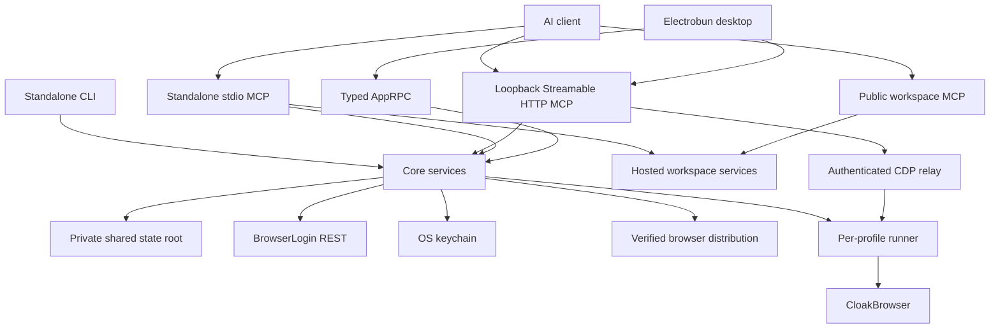

# Architecture, security, and update model

## Process topology

The desktop, standalone CLI, and local MCP runtimes share one private state root and transition locks. The runner owns browser launch, readiness, automatic normal-stop detection, archive creation, and relay cleanup. The renderer receives narrow typed RPC methods, never generic filesystem/process/keychain access. The public MCP is separate and cannot reach the local browser runtime.

## State and credentials

The state root contains `state/`, `locks/`, `work/`, `artifacts/`, `cache/`, `browser-cache/`, `launch/`, `gates/`, `controls/`, `ready/`, and `logs/`. Writes use temporary-file-plus-rename publication and verify final bytes. Linked/reparse/non-regular paths fail closed.

`connection.json` stores schema version, base URL, and `key_ref: "keychain"`; it does not store the API key. macOS uses a bounded Security-framework helper, Windows uses PasswordVault through PowerShell stdin, and Linux uses Secret Service when available. Child environments are allowlisted/scrubbed so API keys, tokens, licenses, and proxy passwords do not leak across boundaries.

## Session lifecycle

Start uses stable idempotency keys, verifies/extracts any remote archive with traversal/symlink/size/count bounds, launches the runner, and persists readiness. Normal stop verifies process identity, creates one immutable ZIP, uploads those exact bytes, commits the remote stop, and adopts the committed archive. Force stop requires `FORCE CLOSE <profile_id>`, uploads no archive, and may discard local work. Recovery resumes persisted transitions without duplicate sessions, uploads, or commits.

### Local profile archive reuse

The remote start response described in `docs/api.md` remains authoritative. Local archive reuse is only a transfer optimization: a client may skip the authenticated archive download only when the response's current archive identity exactly matches a committed local entry by canonical application origin, profile ID, generation, byte size, `zip` format, and lowercase SHA-256, and a fresh hash of the local ZIP bytes confirms that size and digest.

Entries use the private namespace `<state-root>/cache/profile-archives/<sha256(canonical-origin)>/<sha256(profile-id)>/`; raw origins and profile IDs are not path components. Each namespace retains one committed generation: an immutable `<generation>-<sha256>.zip` plus `current.json`, which is the commit pointer. Paths must remain private regular files and directories; symlinks, reparse points, unsafe permissions or ownership, malformed metadata, and paths outside the namespace fail closed. Chromium HTTP, GPU, code, and other disposable browser caches under `browser-cache/` are never retained, restored, or uploaded as profile archives.

| Remote and local state                                                        | Start decision                                                                                                         |
| ----------------------------------------------------------------------------- | ---------------------------------------------------------------------------------------------------------------------- |
| Remote archive is `null`                                                      | Remove the committed local entry and start without an archive download.                                                |
| Exact metadata match and freshly verified local ZIP                           | Extract the local ZIP and make zero archive download calls.                                                            |
| Local entry is missing, stale, unsafe, unreadable, malformed, or hash-corrupt | Make one authenticated download, verify and extract it, then atomically refresh the local entry.                       |
| Verified local ZIP fails bounded extraction                                   | Invalidate it, make one authenticated download, and atomically refresh after the downloaded ZIP verifies and extracts. |
| Downloaded ZIP fails identity verification or extraction                      | Fail launch without a retry loop or promotion of invalid bytes.                                                        |
| Verified download succeeds but local refresh has a storage failure            | Launch from the verified restored bytes; cache refresh remains best effort at start.                                   |

Normal stop creates and verifies one ZIP, streams those exact bytes, and waits for the server's atomic stop response and committed `archive_generation`. It then strictly publishes the complete committed identity to the local cache before marking recovery done or deleting transient run artifacts. Cache publication copies and verifies immutable ZIP bytes, fsyncs them, atomically replaces `current.json`, and only then removes the previous generation and abandoned temporaries. A crash before the pointer replacement leaves the previous generation authoritative; a crash after replacement leaves the new pointer authoritative and cleanup is idempotent. Recovery at either post-stop crash point adopts the committed archive without repeating the upload or remote stop commit. Force-stop performs no adoption or invalidation and preserves the previously committed cache.

Archive transfer progress is a Desktop presentation concern only. Application sessions maintain byte-verified per-profile upload/download state, reserve 100 percent for verified completion, and expose one typed snapshot containing all profiles. The Desktop Profiles view polls that single snapshot every 250 ms only while a launch or normal-stop action is pending, showing accessible 0-100 download or upload progress; a cache-hit launch creates no transfer progress. Failed transfers remain distinguishable at their last verified byte count. CLI and MCP lifecycle calls remain synchronous and do not expose archive progress.

## Relays

- Credentialed SOCKS5 uses a per-run authenticated upstream relay; Chromium receives only an unauthenticated loopback endpoint.
- The CDP relay authenticates a one-time loopback URL, caps frames at 16 MiB, serializes input, cancels on navigation/detach, and returns generic errors.
- Local MCP uses stateless Streamable HTTP on `127.0.0.1:43110`, validates `Host` headers, and follows the desktop lifecycle.
- Public MCP uses bearer-authenticated HTTPS and exposes hosted workspace operations only.
- Standalone stdio MCP reserves stdout for JSON-RPC and runs independently of the desktop process.

## Binary trust

Official downloads verify signed manifest metadata, archive SHA-256/size, safe extraction, and atomic cache publication. Custom HTTPS sources are isolated and labelled `unverified-custom`; they cannot alias official cache entries. BrowserLogin release assets must not contain CloakBrowser/Chromium binaries.

## Updates

Electrobun produces platform installers/archives and update metadata. Tagged releases preserve history; `stable` changes only after all platforms/checksums verify, with metadata uploaded last. Prereleases never mutate `stable`.

Unsigned check/download works, but reliable unsigned apply was not proven on every platform. The UI therefore provides a tagged-release download fallback instead of claiming silent installation.

## Diagnostics

Logs are bounded and redacted. Renderer schemas strip proxy passwords and expose credential presence rather than values.

`BROWSERLOGIN_LAUNCH_TIMING=1` enables monotonic development diagnostics at confirmed backend launch boundaries: `remote-session-start`, optional `archive-download-restore`, `runner-spawn`, optional `socks-relay-ready`, `cloakbrowser-context-launch`, and `cdp-readiness`. The permanent launch UI separately measures `ui-cache-refresh`. Diagnostic records contain only allowlisted stage names and millisecond durations; profile identifiers, proxy credentials, launch-file contents, license data, URLs, and error payloads are excluded.

## Blocked realtime subscriptions

Convex-backed reactive tables remain blocked until the server supplies a deployment URL, generated query identifiers, authentication/token exchange, authorized table or event schemas, and reconnect semantics. The client intentionally has no speculative Convex dependency, configuration, or subscription code; REST and the existing application cache remain authoritative until that contract exists.
