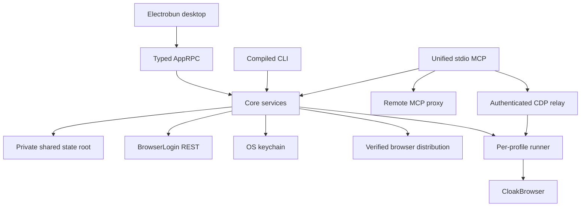

# Architecture, security, and update model

## Process topology

Desktop, CLI, and MCP share one state root and transition locks. The runner owns browser launch, readiness, automatic normal-stop detection, archive creation, and relay cleanup. The renderer receives narrow typed RPC methods, never generic filesystem/process/keychain access.

## State and credentials

The state root contains `state/`, `locks/`, `work/`, `artifacts/`, `cache/`, `browser-cache/`, `launch/`, `gates/`, `controls/`, `ready/`, and `logs/`. Writes use temporary-file-plus-rename publication and verify final bytes. Linked/reparse/non-regular paths fail closed.

`connection.json` stores schema version, base URL, and `key_ref: "keychain"`; it does not store the API key. macOS uses a bounded Security-framework helper, Windows uses PasswordVault through PowerShell stdin, and Linux uses Secret Service when available. Child environments are allowlisted/scrubbed so API keys, tokens, licenses, and proxy passwords do not leak across boundaries.

## Session lifecycle

Start uses stable idempotency keys, verifies/extracts any remote archive with traversal/symlink/size/count bounds, launches the runner, and persists readiness. Normal stop verifies process identity, creates one immutable ZIP, uploads those exact bytes, commits the remote stop, and adopts the committed archive. Force stop requires `FORCE CLOSE <profile_id>`, uploads no archive, and may discard local work. Recovery resumes persisted transitions without duplicate sessions, uploads, or commits.

## Relays

- Credentialed SOCKS5 uses a per-run authenticated upstream relay; Chromium receives only an unauthenticated loopback endpoint.
- The CDP relay authenticates a one-time loopback URL, caps frames at 16 MiB, serializes input, cancels on navigation/detach, and returns generic errors.
- Remote MCP uses stateless bounded POSTs, redirect/body limits, private-address rejection, cancellation, and auth-failure throttling.

## Binary trust

Official downloads verify signed manifest metadata, archive SHA-256/size, safe extraction, and atomic cache publication. Custom HTTPS sources are isolated and labelled `unverified-custom`; they cannot alias official cache entries. BrowserLogin release assets must not contain CloakBrowser/Chromium binaries.

## Updates

Electrobun produces platform installers/archives and update metadata. Tagged releases preserve history; `stable` changes only after all platforms/checksums verify, with metadata uploaded last. Prereleases never mutate `stable`.

Unsigned check/download works, but reliable unsigned apply was not proven on every platform. The UI therefore provides a tagged-release download fallback instead of claiming silent installation.

## Diagnostics

Logs are bounded/redacted. MCP stdout remains protocol-only. Renderer schemas strip proxy passwords and expose credential presence rather than values.

`BROWSERLOGIN_LAUNCH_TIMING=1` enables monotonic development diagnostics at confirmed backend launch boundaries: `remote-session-start`, optional `archive-download-restore`, `runner-spawn`, optional `socks-relay-ready`, `cloakbrowser-context-launch`, and `cdp-readiness`. The permanent launch UI separately measures `ui-cache-refresh`. Diagnostic records contain only allowlisted stage names and millisecond durations; profile identifiers, proxy credentials, launch-file contents, license data, URLs, and error payloads are excluded.

## Blocked realtime subscriptions

Convex-backed reactive tables remain blocked until the server supplies a deployment URL, generated query identifiers, authentication/token exchange, authorized table or event schemas, and reconnect semantics. The client intentionally has no speculative Convex dependency, configuration, or subscription code; REST and the existing application cache remain authoritative until that contract exists.
